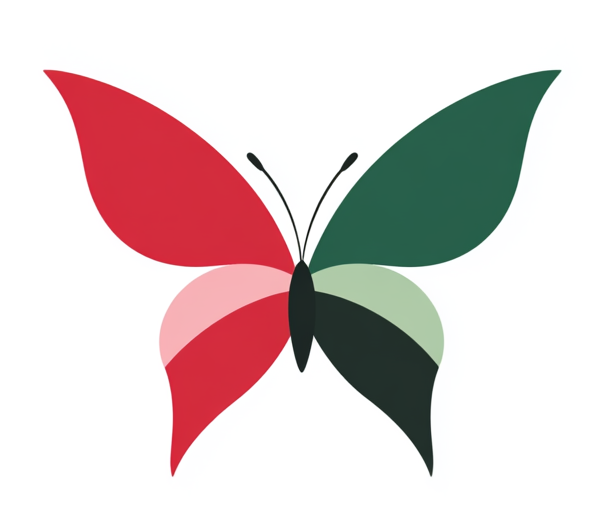
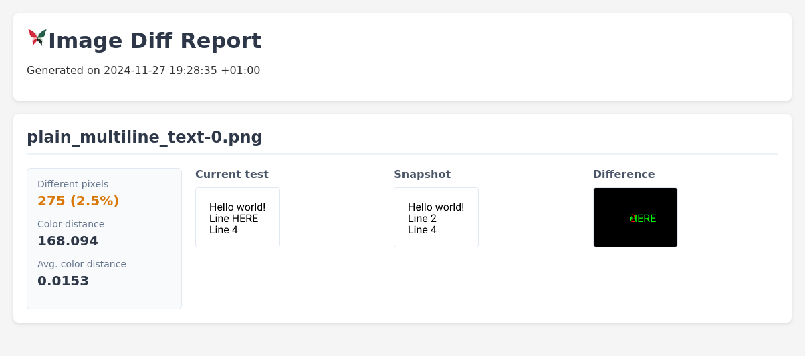

<p align="center">

</p>

# Kompari

*Kompari* is a tool for reporting image differences. It is intended for use in snapshot testing.
It can be used as a stand-alone CLI tool or as a Rust crate.




## CLI

### Local build

```commandline
$ cargo build --release
```

### Usage

Create static HTML report:

```commandline
$ cargo run --release report <left/image_dir> <right/image_dir>
```

Start HTTP server for interactive test blessing:

```commandline
$ cargo run --release review <left/image_dir> <right/image_dir>
```


## Minimum supported Rust Version (MSRV)

This version of Kompari has been verified to compile with **Rust 1.82** and later.

Future versions of Kompari might increase the Rust version requirement.
It will not be treated as a breaking change and as such can even happen with small patch releases.

<details>
<summary>Click here if compiling fails.</summary>

As time has passed, some of Kompari's dependencies could have released versions with a higher Rust requirement.
If you encounter a compilation issue due to a dependency and don't want to upgrade your Rust toolchain, then you could downgrade the dependency.

```sh
# Use the problematic dependency's name and version
cargo update -p package_name --precise 0.1.1
```

</details>

## License

Licensed under either of

- Apache License, Version 2.0 ([LICENSE-APACHE](LICENSE-APACHE) or <http://www.apache.org/licenses/LICENSE-2.0>)
- MIT license ([LICENSE-MIT](LICENSE-MIT) or <http://opensource.org/licenses/MIT>)

at your option.
